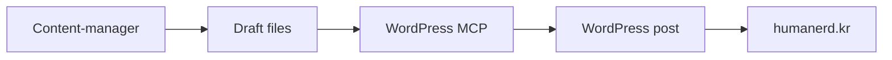

# WordPress Deployment

WordPress runs locally in Docker (colima) on the Mac Mini, with data on the NAS via SMB mount.

## Architecture

```
Docker (colima) ──→ WordPress (localhost:8080)
                      ├── MySQL 8.0 (localhost:3307)
                      ├── wp-content/ → /Volumes/humanerd/docker/wordpress/ (NAS)
                      └── MCP server → Hermes config.yaml mcp_servers.wordpress
```

## Quick Start

```bash
cd ~/.drewgent/wordpress
export DOCKER_HOST=unix:///Users/drew/.colima/default/docker.sock
docker-compose up -d
```

## Config

| File | Path |
|------|------|
| Docker Compose | `~/.drewgent/wordpress/docker-compose.yml` |
| Credentials | `~/.drewgent/wordpress/.wp-env` (chmod 600) |
| Uploads | `/Volumes/humanerd/docker/wordpress/wp-content/` (NAS) |

## Theme: Blocksy

**Why Blocksy over GeneratePress:** Free version supports custom font upload (Noto Sans KR, Noto Serif KR). GeneratePress requires paid Premium for this.

| Setting | Value |
|---------|-------|
| Theme | Blocksy 2.1.45 |
| Companion | Blocksy Companion plugin |
| Fonts | Noto Sans KR (body), Noto Serif KR (headings), JetBrains Mono (code) — loaded via MU plugin |
| Colors | Warm light palette (#fafaf8 bg, #8b7355 accent, #1c1c1a text) |
| Custom CSS | Injected via WP's built-in Custom CSS |

### Color Palette

```css
--color-bg:          #fafaf8;
--color-surface:     #ffffff;
--color-text:        #1c1c1a;
--color-muted:       #6b6b68;
--color-accent:      #8b7355;  /* bronze */
--color-accent-hover:#7a6349;
--color-border:      #e8e7e4;
```

## MCP Server (Custom)

A STDIO MCP server at `~/.drewgent/scripts/wordpress-mcp-server.js` wraps wp-cli and exposes 7 tools:

| Tool | Description |
|------|-------------|
| `create_post` | Create post with title, content, category, tags, status |
| `upload_media` | Upload image/SVG files |
| `list_posts` | List recent posts |
| `get_post` | Get post by ID |
| `create_category` | Create category |
| `set_site_option` | Set WP option |
| `set_theme_mod` | Set theme mod (JSON) |

The server wraps `docker exec humanerd-wp wp --allow-root` calls and translates JSON-RPC 2.0 requests.

Registered in `~/.hermes/config.yaml`:
```yaml
mcp_servers:
  wordpress:
    command: node
    args: ["/Users/drew/.drewgent/scripts/wordpress-mcp-server.js"]
```

## Content Pipeline Integration

The content-manager agent pushes drafts to WordPress via the MCP server:



## Maintenance

```bash
# View logs
docker logs humanerd-wp
docker logs humanerd-db

# Backup DB
docker exec humanerd-db mysqldump -u humanerd -p humanerd > backup.sql

# Update WordPress
docker exec humanerd-wp wp --allow-root core update

# Update plugins
docker exec humanerd-wp wp --allow-root plugin update --all
```

## Pitfalls

- **Docker socket**: Must use `DOCKER_HOST=unix:///Users/drew/.colima/default/docker.sock` when running commands outside of colima context
- **docker-compose vs docker compose**: This system uses standalone `docker-compose` v5.1.4, not the Docker plugin
- **No wp-cli in container by default**: Installed via `curl -sO https://raw.githubusercontent.com/wp-cli/builds/gh-pages/phar/wp-cli.phar`
- **Permalink rewrite**: Apache's mod_rewrite is enabled but .htaccess must be manually populated with WordPress rewrite rules after permalink changes
