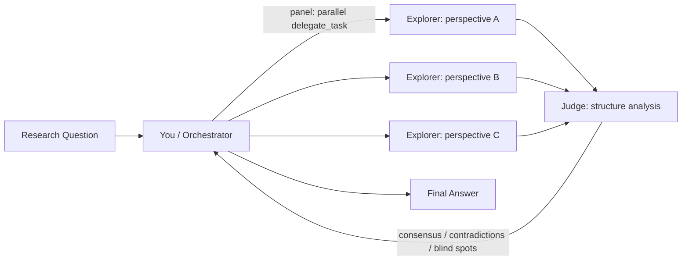

# Fusion Agent — Multi-Model Deliberation on OpenCode Go

## Concept

Fusion은 **여러 관점에서 동시에 분석한 뒤 구조화된 취합을 거쳐 최종 답변**을 만드는 패턴. OpenRouter는 이걸 인프라 레벨(panel + judge API)로 제공하지만, OpenCode Go에서는 같은 패턴을 `task()`로 구현 가능 — 구독료 안에 포함되어 추가 비용 없음.



## When to Use

| Use Fusion | Don't Bother |
|------------|-------------|
| Research questions: "Compare X and Y" | Short tactical prompts: "What's the weather?" |
| High-stakes: code review, architecture decision | Simple Q&A with a known answer |
| Expert critique: "What are the strongest arguments for/against?" | One-line implementations |
| Ambiguous: multiple valid answers, trade-offs | Fact lookup (single source of truth) |
| Cost of being wrong > cost of extra completions | Time-sensitive: Fusion adds latency |

Since OpenCode Go is subscription ($0/call marginal), **cost is never the reason to skip Fusion** — only latency matters.

## How to Run Fusion (3 Phases)

### Phase 1: Panel — Parallel Deliberation

Spawn N subagents (2-5), each with a **distinct perspective**. Use `explorer` profile (or `implementer` for code tasks) — flash-tier is fine since the judge catches blind spots.

```python
task(subagent_type="explorer", description="Security analysis", prompt="Analyze this question from a security perspective: <question>")
task(subagent_type="explorer", description="Performance analysis", prompt="Analyze this question from a performance perspective: <question>")
task(subagent_type="explorer", description="Maintainability analysis", prompt="Analyze this question from a maintainability perspective: <question>")
```

**Panel presets:**

| Preset | Panel Size | Perspectives | Best For |
|--------|-----------|--------------|----------|
| Quality | 3-4 | security, performance, correctness, UX | Code review, architecture |
| Budget | 2 | pros + cons | Quick compare-and-contrast |
| Diversity | 4-5 | academic, industry, contrarian, pragmatic, future-looking | Research, strategy |
| Debug | 3 | root-cause, reproduction, fix-options | Bug diagnosis |

Each panel subagent should have search tools enabled (`toolsets: [terminal, search, file]`) so they can pull fresh context.

### Phase 2: Judge — Structured Synthesis

Collect all panel responses and synthesize them into a structured analysis. The judge role is done by **you** (the orchestrator), not by a subagent — you have all the responses in context.

Structure the analysis:

```markdown
## Synthesis

### Consensus (2+ models agree)
- Point 1
- Point 2

### Contradictions (models disagree)
- Point 1 — Model A says X, Model B says Y

### Partial Coverage (some models addressed, others didn't)
- Point 1

### Unique Insights (only one model raised)
- Insight 1 (from Model A)

### Blind Spots (none of the models addressed)
- Gap 1
```

### Phase 3: Final Answer

Write the final answer using the structured analysis. The consensus points are highest confidence; contradictions should present both sides with the judge's assessment; blind spots get explicitly called out.

## Agent Profile Perspective Examples

Good perspective prompts follow this pattern:

```
Analyze the following from a <perspective> perspective.

Focus on:
- What are the key considerations from this angle?
- What trade-offs or tensions exist?
- What would an expert in this area notice that others might miss?

Question: <question>
```

| Perspective | For |
|-------------|-----|
| `security` | Auth, crypto, injection, data exposure |
| `performance` | Latency, caching, bottlenecks, scaling |
| `maintainability` | Tech debt, extensibility, readability |
| `user-experience` | UX flow, accessibility, error handling |
| `business` | Cost, ROI, market fit, trade-offs |
| `academic` | Theory, literature, formal correctness |
| `contrarian` | What's wrong with the obvious answer? |
| `pragmatic` | What works today with minimal effort? |

## Comparison: Agent-Level vs OpenRouter Fusion

| Dimension | Agent-Level (this skill) | OpenRouter Fusion |
|-----------|------------------------|-------------------|
| Execution | `task()` (tool-level) | `openrouter:fusion` (infra-level) |
| Panel parallelism | Sequential or batch (tool limits) | True parallel (server-side) |
| Cost | $0 (subscription) | ~4-5x single completion |
| Web search | Via subagent tools | Built-in (`openrouter:web_search`) |
| Judge | Manual (orchestrator) | Automatic (judge model produces JSON) |
| Latency | Higher (sequential delegation) | Lower (parallel infra) |
| Transparency | Full — you see every panel response | Opaque — you only see judge summary |

## Related Skills

- [[skills/software-development/model-routing]] — which models to use for which tier
- [[skills/agent-profiles]] — subagent profile system
- [[skills/software-development/subagent-driven-development]] — wave-based batch delegation
- [[skills/software-development/kanban-orchestrator]] — pipeline orchestration
- [[skills/software-development/ponytail]] — before writing Fusion code, check if simpler suffices
