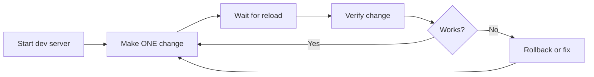

# Full Codebase Audit (Existing Project)

Use this when the user asks you to review an entire project — not a diff of pending
changes, but the whole living codebase. You are finding architecture, security, DB,
and quality issues in already-deployed code.

**Core principle:** Read systematically — config first, entry point, then follow
imports. Never judge a file without knowing where it fits in the dependency graph.

## When to Use

- User says "review this project", "code review", "audit", "architecture review"
- Before starting work on an unfamiliar codebase
- After inheriting a project or acquisition

## Core Principles

1. **Map the full picture before proposing action.** The user knows their system
   — when they say something works but grep says no, check actual deployed
   endpoints before declaring it missing. The deployed version may differ from
   the local code. Ask: "show me / let me check the running site" before
   concluding something doesn't exist.

2. **Root cause before workaround.** When a service fails (API timeout, null
   response), don't propose changing the call order as a fix. First verify the
   keys/endpoints work independently, then trace the exact call chain to find
   the real bottleneck. The user will call out cosmetic fixes that don't address
   the underlying problem.

3. **Map the dependency graph first.** Read config → entry point → follow imports.
   Never judge a file without knowing where it fits. Produce a visual reference
   of import chains, HTML script tags, and CSS @import before proposing changes.

2. **Risk-segment every refactoring proposal.** Before suggesting structural changes,
   categorize each by risk level so the user can decide what's safe:

   | Risk | Criteria | Examples |
   |------|----------|---------|
   | Zero (0%) | Dead code, confirmed no references | Orphaned files, never-read config keys |
   | Low | Verifiable by loading the app | CSS dedup, dead config removal |
   | Medium | Needs careful testing | Module splitting, route refactoring |
   | High | Design-level reconsideration | Bundler adoption, framework migration |

   **Always propose zero-risk items first and ask if the user wants to act on
   them immediately.** Users nearly always appreciate quick safe wins before
   discussing larger plans.

3. **Verify references before pronouncing a file dead.** A grep for the filename
   and its exported symbols across ALL source files (not just JS: also HTML
   `<script src>`, `<link>`, CSS `@import`, config `main` fields). A file
   referenced by zero other files in any form is dead code.

## Systematic Read Order

1. Project config files (package.json, tsconfig, wrangler.jsonc, Dockerfile)
2. Entry point / main module (worker.ts, index.ts, main.py, app.ts)
3. Route handlers (all endpoints, guards, auth flow)
4. Core business logic (modules the entry point imports)
5. Database layer (schema, migrations, query patterns, indexes)
6. Frontend / templates (API exposure, bundling, security headers)
7. Tests (if zero — that's a finding)

## Dead Code Detection (Cross-Reference Audit)

After reading the structure, systematically identify orphaned/dead files and config
before proposing deletions. A file is dead only after you verify zero references.

### Technique

```bash
# 1. Find all files (excluding node_modules, .git, build artifacts)
find . -type f \( -name '*.ts' -o -name '*.js' -o -name '*.html' ...

# 2. For each candidate, check ALL reference types:
#    JS/TS import, ESM import(), require()
grep -rn "filename\|exportedSymbol" --include='*.ts' --include='*.js' source/
#    HTML script src, link href
grep -rn "filename" --include='*.html' source/
#    CSS @import, url()
grep -rn "filename" --include='*.css' source/
#    Config references (wrangler main, package.json bin, Dockerfile COPY)
grep -rn "filename" --include='*.jsonc' --include='*.json' source/

# 3. Check if config keys are actually read (not just defined)
grep -rn "CONFIG_KEY\|EXPORTED_CONST" --include='*.js' --include='*.ts' source/ | grep -v "the_file_it_was_defined_in"
```

### Common Dead Code Patterns

| Pattern | Detection |
|---------|-----------|
| **Orphaned JS/TS module** | `export const X` declared but `import.*X` returns zero hits outside the declaring file |
| **Orphaned mock data** | Large JSON/JS data file that no HTML `<script>` or JS `import` references. Check `DEV_MODE` constant — if it's `false` and the data file was only for dev, it's dead weight in production. Also check via running dev server: request the file URL through the local dev server — 404 confirms it's truly unreachable, not just unchecked by grep |
| **Broken import path** | `import { X } from '../wrong/path'` — if the path doesn't resolve to an existing file, the importing module is itself dead (nothing could use it) |
| **Unused config** | `var: { FOO: "bar" }` in wrangler.jsonc but `env.FOO` never appears in any `.ts` file. Or a `DEV_MODE` boolean that no `if` statement ever checks |
| **CSS dead weight** | Component `.css` file — check if its selectors actually appear in any HTML/JS template string. If a CSS file has no corresponding UI component, it's dead |
| **Duplicate CSS loading** | Same stylesheet loaded via both `<link>` in HTML AND `@import` in master CSS — the explicit `<link>` is redundant

## Checklist by Layer

### Config and Infra
- Hardcoded secrets in committed config files (OAuth IDs, API keys, DB names)
- `vars` vs `secrets` — sensitive strings exposed in wrangler.jsonc / docker-compose.yml
- `|| 'fallback-for-dev'` — hardcoded fallback secrets that leak to production
- CSP / CORS headers correctly scoped (no wildcard `*`)
- Environment interface matches actual env access

### Entry Point and Routing
- Module size over 500 lines likely needs splitting
- Duplicated utility functions (e.g. safeJson defined twice)
- Error boundary at top-level — global catch?
- Cookie security — HttpOnly, SameSite, Secure flag

### Security (grep for these)
- `as any` volume — especially with TypeScript `strict: true`
- `Math.random()` for ID generation — use `crypto.randomUUID()`
- API key in URL query param instead of `Authorization` header
- Safety settings bypassed (`threshold: 'BLOCK_NONE'` on all categories)
- `eval()` or `new Function()` in production code

### Frontend Data Exposure (console.log + localStorage)

Audit sensitive data that ends up in browser-visible storage (devtools Console or
Application → Local Storage / Session Storage), which any user with devtools open
can inspect.

**Checklist:**

- [ ] `console.log("Authenticated as:", email)` — user PII in console
- [ ] `console.debug('[Tracker]', params)` — user event data in debug log
- [ ] `console.error('failed:', response, result)` — API response body with birth data/pillars in error log
- [ ] `localStorage.setItem('__DATA__', JSON.stringify(apiResponse))` — full API response with PII in localStorage
- [ ] API response objects stored without encryption in localStorage/sessionStorage

**Audit technique:**

```bash
# Find all console.log/error/warn that might expose data
grep -rn "console\\.log\\|console\\.error\\|console\\.warn" --include='*.js' public/ | \
  grep -v "console.log('.*Loaded'\|'SW registered\|'Initializing\|'Switching view'"

# Find localStorage writes of API responses
grep -rn "localStorage\\.setItem" --include='*.js' --include='*.ts' public/ src/
```

### Database
- Missing indexes on FK columns (common: user_id, tenant_id)
- N+1 queries — SELECT inside a for loop instead of batch/join
- Migration runner — versioned SQL files exist but no way to apply them?
- `JSON.parse(form_data)` without try/catch — fragile
- No input validation on freeform JSON fields

### Frontend (web apps)
- API endpoint directly exposed to browser (should proxy through backend)
- Module bundler absent — N separate ESM imports = N HTTP requests
- `unsafe-inline` in CSP — acceptable only with nonce
- Every API call has a try/catch and user-facing fallback

### Business Logic
- Empty catch blocks / fire-and-forget (email errors, analytics)
- Race conditions — read-then-write without transactions
- Token expiry: `payload.exp < Date.now()` — verify unit consistency
- OAuth state parameter — random, validated, single-use

## Cross-Worker Data Duplication (Multi-Wrangler Projects)

During audit, check if the project contains **multiple wrangler configs** that deploy separate Workers sharing domain data:

```bash
find . -name 'wrangler*.jsonc' -not -path '*/node_modules/*'
```

If yes, audit each for hardcoded domain constants:
- 천간/지지 arrays
- Element/color mappings
- Relationship groups (삼합/육합/육충)
- API endpoint URLs

**Fix**: Create a single master JSON (see `references/multi-worker-master-data.md`) and have all Workers import it. Frontend keeps a copy with a reference comment.

## Browser Data Exposure Hardening (localStorage → sessionStorage)

When auditing frontend data persistence, check for sensitive data stored in
`localStorage` (persists indefinitely, accessible via devtools → Application tab).

**The fix pattern:** migrate PII and API responses from `localStorage` to
`sessionStorage` — same API, same keys, same code, just `sessionStorage` instead
of `localStorage`. Data survives page refresh (same tab) but is cleared when the
tab closes.

```javascript
// BEFORE (persists in browser forever):
localStorage.setItem('__SAJU_DATA__', JSON.stringify(apiResponse));

// AFTER (cleared on tab close):
sessionStorage.setItem('__SAJU_DATA__', JSON.stringify(apiResponse));
```

| Storage type | Survives refresh | Survives tab close | Accessible from other tabs |
|-------------|:-:|:-:|:-:|
| `localStorage` | ✅ | ✅ | ✅ (same origin) |
| `sessionStorage` | ✅ | ❌ | ❌ |

### Audit checklist for data exposure

- [ ] `console.log("Authenticated as:", email)` → change to `user.id` or remove
- [ ] `console.error('failed:', result)` with full API response → remove `result` param
- [ ] `localStorage.setItem('__DATA__', JSON.stringify(rawResponse))` → migrate to `sessionStorage`
- [ ] Form data containing PII (name, birthday, location) in localStorage → migrate

## Verification via Local Dev Server

For projects that run a local dev server (wrangler, next dev, vite, uvicorn), 
use it as your primary verification tool during refactoring:

1. **Start the server first** — background process with `notify_on_complete=true`
2. **Test before change** — curl key endpoints, confirm baseline 200
3. **One change at a time** — edit, wait for hot reload (or restart manually), then test
4. **Check 200s, not just no-errors** — grep for bad status codes: all expected resources return 200, deleted files return 404
5. **Test the full resource chain** — for frontend apps: HTML → CSS @import chain → JS module resolution → API endpoints

```bash
# Verify all expected resources return 200
for path in "/" "/app/" "/app/css/index.css" "/app/js/app.js"; do
  echo -n "GET $path => "
  curl -s -o /dev/null -w "%{http_code}" "http://localhost:8787$path"
  echo
done

# Verify deleted files truly gone
for path in "/app/js/saju-data.js" "/app/js/ganji.js"; do
  echo -n "GET $path => "
  curl -s -o /dev/null -w "%{http_code}" "http://localhost:8787$path"
  echo "  (expect 404)"
done
```

**This catches what grep misses**: a file that `grep` says is unreferenced might still be loaded at runtime by a dynamic mechanism. A curl-verified 404 is definitive.

## Incremental Refactoring Strategy

When the user says "refactor this" (as opposed to "review this"), never propose
a monolithic change. Instead:

1. **Risk-segment every proposal** into zero-risk, low, medium, high (see table above).
2. **Start with zero-risk items** (dead code deletion, dead config removal, 
   duplicate markup) — these can be done in minutes with no testing burden.
3. **Propose the order** and ask the user to confirm before executing anything.
4. **Execute one tier at a time**, testing between each.
5. **Only discuss larger refactoring** after safe wins are done — users build
   trust from the quick wins and engage more thoughtfully on the hard decisions.

**Safe-by-default principle**: If a change needs more than 5 minutes of testing
to be confident, it's not zero-risk. Rename it to "low risk" and plan
verification steps before attempting.

## Scoring Framework

| Category | What to Judge |
|----------|---------------|
| Security | Hardcoded secrets, XSS, SQLi, CSP, OAuth flow |
| Code Quality | `any` usage, duplication, module size, type safety |
| Architecture | Separation of concerns, module dependency, front-back division |
| Testing | Test presence, coverage, CI integration |
| DB Design | Schema, indexes, migration strategy, query patterns |
| Frontend | Bundling, API exposure, error handling, CSP compliance |

Each scored 0-10 with evidence. Total = average of 6.

## Output Format

```
# {Project} — Full Codebase Audit
Scope: files read, LOC, date  Score: X.X/10

## Security (n/10)
- CRITICAL: {issue at file:line} — {risk scenario}
- HIGH: {issue with evidence and recommendation}

## Code Quality (n/10)
...

## Priority Action Items
P0 — {security}
P1 — {quality/design}
P2 — {perf/testing}
```

## Checklist for Each Finding
- Specific location (file:line) identified
- Severity tagged (CRITICAL / HIGH / MEDIUM / LOW)
- Evidence quoted (code excerpt)
- Recommendation actionable
- Risk scenario described
## Cloudflare Workers / D1 Specific

- `as any` on D1 `.first()` / `.all()` results — define typed interfaces
- Workers AI / API key in URL — use header-based auth (`x-goog-api-key` header instead of `?key=` query param)
- OAuth IDs in wrangler.jsonc `vars` — should be `secrets` (especially `NAVER_CLIENT_SECRET`, `GOOGLE_CLIENT_SECRET`). Client IDs are semi-public but reduce exposure surface
- `SESSION_SECRET` must never fall back to a hardcoded string — `env.SECRET || 'fallback'` in production means everyone uses the same HMAC key
- D1 batch API for bulk ops — `env.DB.batch([...])` avoids N+1 SELECT-in-loop patterns
- R2 or D1 for session storage instead of HMAC cookie if session size grows
- **`env.ASSETS.fetch()` quirk in wrangler dev**: requesting a rewritten URL through `env.ASSETS.fetch(newReq)` may return 404 in dev mode even though the same URL returns 200 when accessed directly. Prefer a 302 redirect to the canonical URL over internal URL rewriting for extension-less file access — the browser follows the redirect and the direct path reaches the assets handler correctly

## Pitfalls
- Not a git repo — use `find` instead of git commands to map structure
- Monorepo — ask which package is in scope
- Generated code — skip node_modules/, .wrangler/, dist/
- Big project — cap at about 40 source files; ask user which module to focus on
- Scoring is subjective — always cite a concrete code excerpt. A score without evidence is noise

***

# Pre-Commit Code Verification

Automated verification pipeline before code lands. Static scans, baseline-aware
quality gates, an independent reviewer subagent, and an auto-fix loop.

**Core principle:** No agent should verify its own work. Fresh context finds what you miss.

## When to Use

- After implementing a feature or bug fix, before `git commit` or `git push`
- When user says "commit", "push", "ship", "done", "verify", or "review before merge"
- After completing a task with 2+ file edits in a git repo
- After each task in subagent-driven-development (the two-stage review)

Skip for: documentation-only changes, pure config tweaks, or when user says "skip verification".

### When reviewing an entire codebase (not just a diff)

This skill normally verifies a git diff before commit. But the approach also
works for **systematic codebase audit** — mapping the full dependency graph,
finding dead code, consolidating duplicated data, and fixing security issues
one by one. The workflow is the same; only the scope is different.

**Core principle:** Start with zero-risk changes (delete files nothing
references), then gradually increase risk, testing each step against a live
dev server. Let the user decide trade-offs — do not argue optimization
trivialities before they ask.

#### Systematic audit workflow

1. **Map the dependency graph** — trace imports, HTML `<link>`/`<script>` refs,
   CSS `@import` chains. Know what references what before touching anything.
2. **Dead code detection** — search for references to a file or key before
   deleting it. A file no code imports and no HTML loads is safe to remove.
   Check: `import` statements, `<script src>`, `<link href>`, `require()`.
3. **Data duplication tracing** — when the same data appears in 2+ locations
   (e.g. 천간/지지 mappings in frontend + backend), trace ALL copies before
   consolidating. Create a master source (JSON), then have each consumer
   reference it.
4. **Test after each change** — keep the dev server running (`npm run dev`,
   `wrangler dev`, etc.) and verify the app still loads after each edit.
   Check: HTTP 200 on pages, API responses, no new 404s.
5. **Security hygiene** — scan `console.log` calls for PII (email, raw API
   responses). Migrate sensitive data from `localStorage` to `sessionStorage`
   so it clears on tab close.

**This skill vs github-code-review:** This skill verifies YOUR changes before committing.
`github-code-review` reviews OTHER people's PRs on GitHub with inline comments.

## Step 1 — Get the diff

```bash
git diff --cached
```

If empty, try `git diff` then `git diff HEAD~1 HEAD`.

If `git diff --cached` is empty but `git diff` shows changes, tell the user to
`git add <files>` first. If still empty, run `git status` — nothing to verify.

If the diff exceeds 15,000 characters, split by file:
```bash
git diff --name-only
git diff HEAD -- specific_file.py
```

## Step 2 — Static security scan

Scan added lines only. Any match is a security concern fed into Step 5.

```bash
# Hardcoded secrets
git diff --cached | grep "^+" | grep -iE "(api_key|secret|password|token|passwd)\s*=\s*['\"][^'\"]{6,}['\"]"

# Shell injection
git diff --cached | grep "^+" | grep -E "os\.system\(|subprocess.*shell=True"

# Dangerous eval/exec
git diff --cached | grep "^+" | grep -E "\beval\(|\bexec\("

# Unsafe deserialization
git diff --cached | grep "^+" | grep -E "pickle\.loads?\("

# SQL injection (string formatting in queries)
git diff --cached | grep "^+" | grep -E "execute\(f\"|\.format\(.*SELECT|\.format\(.*INSERT"
```

## Step 3 — Baseline tests and linting

Detect the project language and run the appropriate tools. Capture the failure
count BEFORE your changes as baseline_failures (stash changes, run, pop).
Only NEW failures introduced by your changes block the commit.

**Test frameworks** (auto-detect by project files):
```bash
# Python (pytest)
python -m pytest --tb=no -q 2>&1 | tail -5

# Node (npm test)
npm test -- --passWithNoTests 2>&1 | tail -5

# Rust
cargo test 2>&1 | tail -5

# Go
go test ./... 2>&1 | tail -5
```

**Linting and type checking** (run only if installed):
```bash
# Python
which ruff && ruff check . 2>&1 | tail -10
which mypy && mypy . --ignore-missing-imports 2>&1 | tail -10

# Node
which npx && npx eslint . 2>&1 | tail -10
which npx && npx tsc --noEmit 2>&1 | tail -10

# Rust
cargo clippy -- -D warnings 2>&1 | tail -10

# Go
which go && go vet ./... 2>&1 | tail -10
```

**Baseline comparison:** If baseline was clean and your changes introduce failures,
that's a regression. If baseline already had failures, only count NEW ones.

## Step 4 — Self-review checklist

Quick scan before dispatching the reviewer:

- No hardcoded secrets, API keys, or credentials
- Input validation on user-provided data
- SQL queries use parameterized statements
- File operations validate paths (no traversal)
- External calls have error handling (try/catch)
- No debug print/console.log left behind
- No commented-out code
- New code has tests (if test suite exists)

## Step 5 — Independent reviewer subagent

Call `delegate_task` directly — it is NOT available inside execute_code or scripts.

## Step 6 — Evaluate results

Combine results from Steps 2, 3, and 5.

**All passed:** Proceed to Step 8 (commit).

**Any failures:** Report what failed, then proceed to Step 7 (auto-fix).

## Step 7 — Auto-fix loop

Maximum 2 fix-and-reverify cycles.

## Step 8 — User confirmation before commit

**ALWAYS get explicit user confirmation before committing.** The user reviews
what's staged. A commit without their approval is a workflow violation.

- Show `git status --short` after all changes are made
- Wait for user to say "commit" or "go ahead"
- Do NOT auto-proceed. The user may want to amend, split, or discard changes.
- Only commit after confirmation using `git add -A && git commit -m "..."`

**Why this step matters:** Even when checks pass, the user may have context you
don't — a deployment freeze, a branch strategy, or unfinished features. A commit
that looks correct to you but conflicts with their workflow is worse than a test
failure. Get a verbal or typed go-ahead first.

**After user approval:** Write a descriptive commit message summarizing WHAT
changed and WHY. The `[verified]` prefix is optional — let the user's repo
convention decide.

## Iterative Development Loop (Live Dev Server)

The user's preferred working style, stated explicitly and reinforced by
correction. Encode this as a workflow, not a suggestion.

**Core principle:** One change at a time. Keep the dev server running between
each edit. Verify after every single edit before proceeding.

### When to Use

Always. This is the default workflow for all code changes in projects with a
local dev server (wrangler, next dev, vite, uvicorn, etc.).

### The Loop



### Detailed Steps

1. **Start the dev server first** (background process with log file):
   ```bash
   cd /project && npm run dev > /tmp/dev.log 2>&1
   ```
2. **Establish baseline** — verify the app loads (200 on main routes) before touching anything.
3. **Make ONE change** — edit a single file, one logical change.
4. **Wait for hot reload** — wrangler/vite/next auto-reload. Check the dev log for reload confirmation:
   ```
   ⎔ Reloading local server...
   ⎔ Local server updated and ready
   ```
5. **Verify the change** — curl the affected route or load the SPA page:
   ```bash
   curl -s -o /dev/null -w "%{http_code}" http://localhost:8787/app/
   ```
6. **If it works → proceed to next change. If not → rollback or fix immediately.**
   - NEVER stack multiple changes without verifying each one.
   - NEVER fix problem B found during a change without completing change A first.
7. **Repeat** steps 3-6 for each change.

### Why This Matters

- **The user confirmed this explicitly:** "변경은 run dev의 로그를 보면서 하고 있는거지?"
  meaning: are you watching the dev server reload log while making changes?
  This is a workflow expectation, not a nice-to-have.
- **Deployed reality check:** When you say "it works" but the server was dead,
  the user loses trust. Check the log tail after every reload cycle.
- **Error isolation:** If two changes are stacked and the server breaks, you
  can't tell which one caused it. One-at-a-time means you always know the cause.

### Pitfalls

- **Background stdout is invisible with `notify_on_complete=true`** — the log
  file approach (`> /tmp/dev.log 2>&1`) is better because you can tail it.
- **Terminal output buffering** — some CLI tools (wrangler) may buffer stderr
  and stdout differently. If the log file appears empty, the output may be
  going to stderr while the file captures stdout. Include `2>&1` in the redirect.
  If still empty, write to a file instead of relying on process output capture.
- **Build errors kill hot reload** — if the dev log shows `✘ [ERROR] Build failed`,
  the reload didn't happen. Fix the error before testing.
- **Port conflicts** — `lsof -ti :8787 | xargs kill -9` before starting a new
  dev server. Two instances on the same port produce SQLITE_BUSY or ADDR_IN_USE.
- **D1 SQLITE_BUSY after crash** — wrangler dev's local D1 database can stay
  locked if wrangler exits uncleanly. Remove `.wrangler/state/v3/d1/` before
  restarting: `rm -rf .wrangler/state/v3/d1/`

## Pitfalls

- **Deployed ≠ integrated, reachable ≠ wired.** When the user says a service
  "works" but grep finds no cross-reference in the source tree, the user is
  correct that the service IS alive at its URL. The gap is that the main
  application code hasn't called it yet. Always check BOTH:
  1. `grep -rn "service-url" --include='*.ts' --include='*.js' src/` — source refs
  2. `curl -s -o /dev/null -w "%{http_code}" https://service-url/` — liveness
  Then report accurately: "Service X responds 200 at its URL. Zero integration
  code in the app." Don't insist it doesn't exist when the user means it's
  deployed and reachable. The user's exact phrasing: "되어 있다고. 되어 있어야
  하는데?" — they know it works. Find out how, don't declare it missing.

- **Map the full system before saying anything is missing.** When the user points
  to a directory like `Log-Project/` containing multiple sub-projects, read the
  whole layout before asserting connections. The user's mental model may include
  services deployed independently that the code hasn't wired together yet.

- **Check AGENTS.md / project rules first.** Before starting work on a project
  you've worked on before, re-read the project's AGENTS.md if it exists. It may
  contain updated policies about tiered autonomy, commit discipline, and review
  workflow that override this skill's defaults.
- **Don't jump to action without analysis first.** Before deleting or refactoring,
  map the full dependency graph and present findings to the user. Let them
  decide the trade-offs rather than optimizing prematurely on their behalf.
  When the user says "좀 더 세부적으로 보고 해줘" — they want data, not action.
- **Don't argue optimization that doesn't matter yet.** "This adds 79KB of
  unnecessary CSS" ignores browser caching. State facts (X bytes), not value
  judgments ("waste"). Let the user decide.
- **CSS consolidation: check caching before calling it "waste".** When considering
  whether to add a page to the master CSS `@import` chain, the extra bytes are
  almost always served from browser cache (users visit the SPA first). Only avoid
  consolidation when the page is a rare entry point AND the user explicitly
  confirms the trade-off is meaningful. Use the checklist above — present data, not opinions.
- **Empty diff** — check `git status`, tell user nothing to verify
- **Not a git repo** — skip and tell user
- **Large diff (>15k chars)** — split by file, review each separately
- **delegate_task returns non-JSON** — retry once with stricter prompt, then treat as FAIL
- **False positives** — if reviewer flags something intentional, note it in fix prompt
- **No test framework found** — skip regression check, reviewer verdict still runs
- **Lint tools not installed** — skip that check silently, don't fail
- **Auto-fix introduces new issues** — counts as a new failure, cycle continues
- **node_modules/.bin symlinks corrupted by Synology Drive** — macOS: Synology Drive
  replaces symlinks with `XSym` metadata files. If `npx wrangler dev` fails with
  `XSym: command not found`, check `.bin/wrangler`. Fix: delete the XSym file and
  recreate the symlink (`ln -s ../wrangler/bin/wrangler.js node_modules/.bin/wrangler`).
  Check ALL `.bin/*` entries and fix any that start with `XSym`. Then `npm run dev` works.

## Related
- [[P3-sensors/skills/SKILL-INDEX]]

## Reference Files
- `references/codebase-audit-patterns.md` — grep patterns for dead code
  detection, data duplication tracing, API layer tracing (deployed vs integrated
  distinction), localStorage → sessionStorage migration, and console.log PII
  audit. Consult this when doing systematic cleanup.
- `codebase-consolidation` — when audit finds the same data defined independently in frontend and separate backend workers (shared constants, lookup tables), use this skill for the consolidation fix pattern
- `references/multi-worker-master-data.md` — pattern for sharing data across separate Cloudflare Workers via a JSON bridge
- `references/multi-controller-refactoring.md` — monolithic worker.ts → controller-based architecture, LLM utility unification (DeepSeek+NVIDIA consolidation), and analysis engine → report pipeline integration patterns
- `references/layer-analysis-system.md` — L0-L3 cumulative pillar analysis engine for fortune-telling apps, layer shift calculation, daewoon-saewoon relation detection, and report controller data bridge
- `references/external-api-priority.md` — PDC data priority: use external API results instead of recalculating. "PDC에서 가져오는 결과를 대입하면 되는데 왜 자꾸 너네들을 계산하려고 하지?"
- `references/cf-workers-pbkdf2-auth.md` — Password auth on Cloudflare Workers using Web Crypto API PBKDF2 (no npm deps). Register + login + dev bypass pattern.

## CSS Import Chain: Cost-Benefit Checklist

When consolidating a page into the master `@import` chain, measure the unused CSS cost:

| Question | Action |
|----------|--------|
| How many KB of unused CSS would be added? | `wc -c` on the master chain vs current page links |
| Is the page a rare entry point (legal, landing)? | If yes, keeping a separate chain is acceptable |
| Is the page visited after the SPA (cached CSS)? | If yes, consolidation is cheap (cache hit) |
| User pushed back on "unnecessary download"? | Reconsider — premature optimization without evidence |
